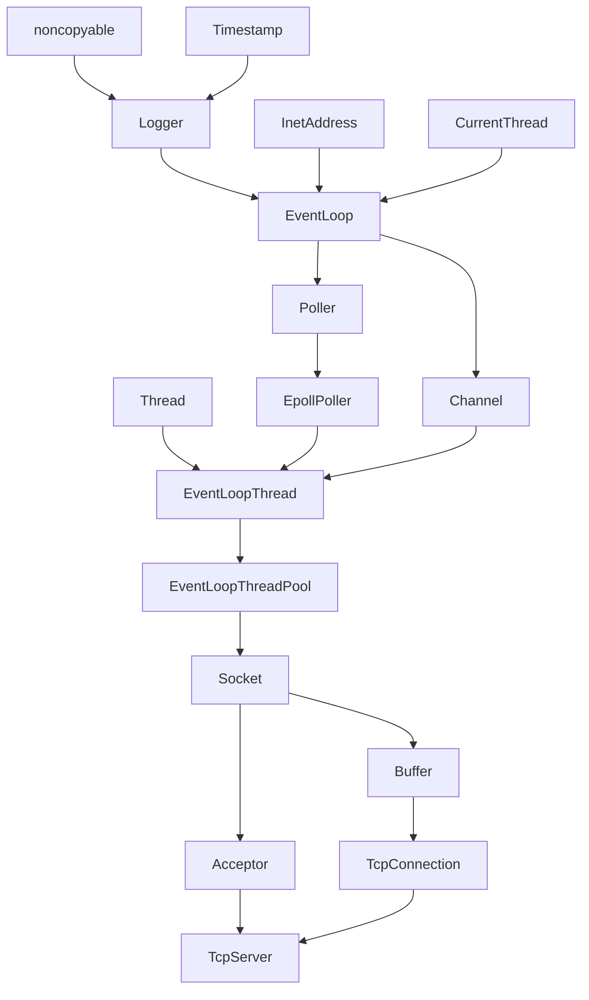

# dwt_rpc_dwt_muduo

基于protobuf的RPC（远程过程调用）框架，提供服务注册和服务调用，使用[dwt_src](https://github.com/dengwangtao/dwt_src)作为服务注册中心。
- 实现了Application、Provider、Channel三个核心模块，分别为框架初始化、服务统一注册和发布、服务统一调用.
- 服务调用方继承Service并重写, 将服务注册到Provider内, 服务调用者通过调用protobuf生成的ServiceRpc_Stub内的方法就可以调用远程方法
- 使用[dwt_src](https://github.com/dengwangtao/dwt_src)作为服务注册中心，服务调用方通过[dwt_src](https://github.com/dengwangtao/dwt_src)发现服务提供方的主机和端口
- 使用protobuf来进行数据序列化和反序列化以及生成Service，以字节流进行数据传输
- 使用json作为配置文件选项，提供dwt_src、日志保存位置、日志等级等配置项

## dwt_src [https://github.com/dengwangtao/dwt_src](https://github.com/dengwangtao/dwt_src)

- 业务服务使用TCP通信, 使用多Reactor模型+one loop per thread并发处理多个tcp连接
- 使用多叉树+智能指针存储children节点, 维护一个sessionMapList来动态删除会话节点(session Node), 当一个会话超时关闭时, 会话节点会被删除. 相反, 永久节点常驻内存中
- 当conntion请求到达后, 会生成sessionId, 用来进行心跳检测, 每次心跳包会带着该sessionId
- 心跳使用UDP进行通信, 客户端需要每隔一段时间发送UDP心跳包来维护session, 服务端维护一个小根堆超时计时器和一个大根堆心跳计数器, 当连续(max_heartbeat=5)次接收不到心跳包, 执行回调, 删除会话节点
- 提供了CLI和静态库两种客户端供第三方使用, 客户端维护一个heartbeat线程发送udp心跳包来保持会话连接

## dwt_rpc [https://github.com/dengwangtao/dwt_rpc](https://github.com/dengwangtao/dwt_rpc)
RPC框架

基于muduo和protobuf的RPC（远程过程调用）框架，提供服务注册和服务调用，使用zookeeper作为服务注册中心。
- 实现了Application、Provider、Channel三个核心模块，分别为框架初始化、服务统一注册和发布、服务统一调用
- 使用zookeeper作为服务注册中心，服务调用方通过ZK发现服务提供方的主机和端口
- 使用protobuf来进行数据序列化和反序列化，以字节流进行数据传输
- 使用json作为配置文件选项，提供ZK、日志保存位置、日志等级等配置项

基本过程：

### Example 调用过程

## dwt_muduo [https://github.com/dengwangtao/dwt_muduo](https://github.com/dengwangtao/dwt_muduo)

- 使用C++11重写muduo, 替换muduo中boost部分，如智能指针、function/bind，并使用C++11的thread
- 实现了主从Reactor模型 + 每线程一个事件循环（one loop per thread）的架构，其中：
    - baseLoop负责接收新客户端连接，并将其分发到subLoop进行处理
    - subLoop负责具体的业务逻辑处理，实现高效的并发处理能力
- 使用eventfd来进行baseLoop对subLoop的唤醒，确保线程间通信的高效性

### 开发顺序

